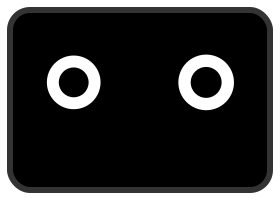
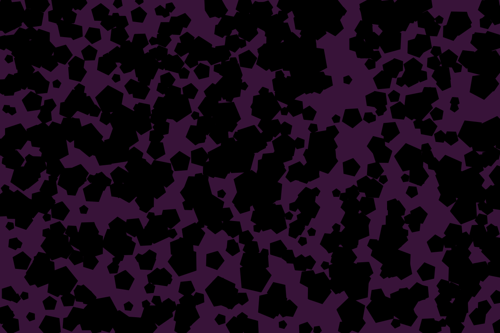

# Generative Art Experiments

Generative art experiments playground powered by vite and svg.js to generate some art like artifacts.
Code is not super reusable, whacky and not very well documented.

## Getting Started

Clone the repository and run the following commands:

```shell
> npm i
> npm run dev
```

## Experiments

### Robots



### Hexagons



### Gradients


## Dev Experience

To download and post process generated SVGs `utils/download-svg.js` can be used.
