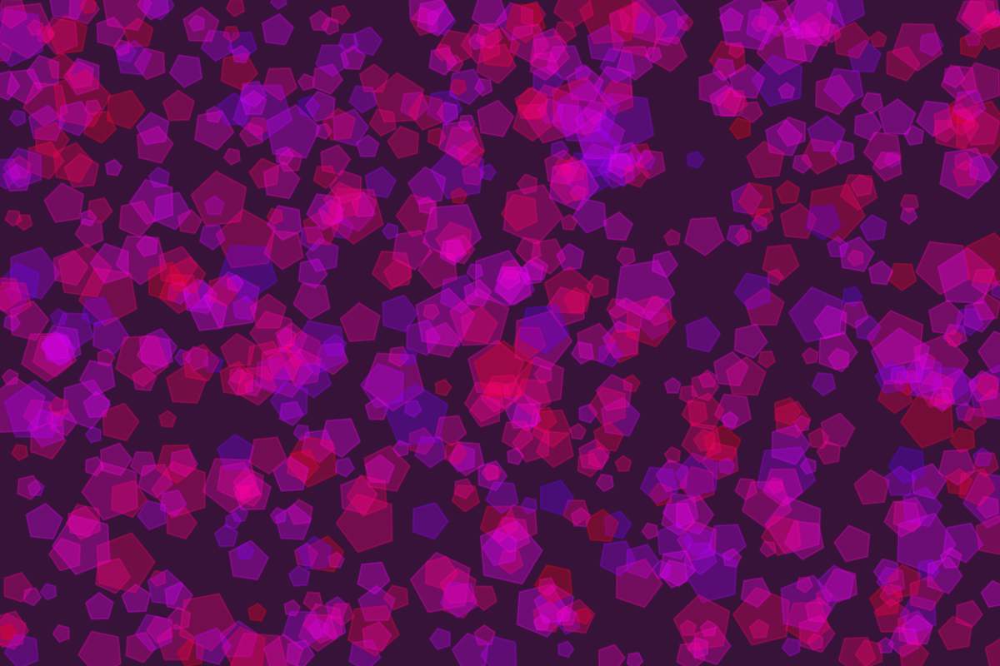
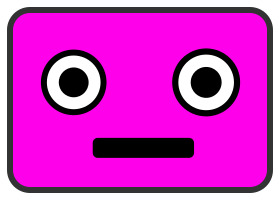
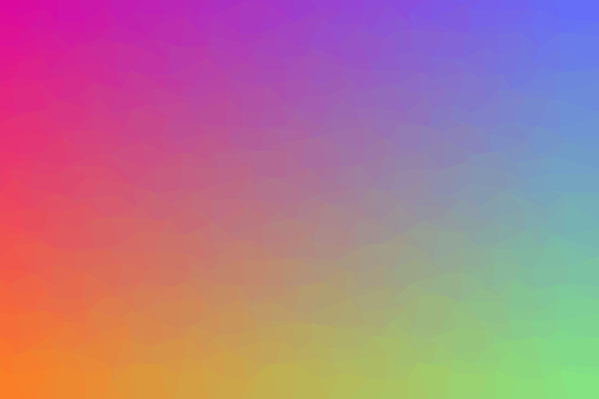

# Generative Art Experiments

A modernized algorithmic SVG generative art playground built with [Vite](https://vite.dev/), [SVG.js](https://svgjs.dev/), simplex noise, and neon chromatic color spaces.

## Highlights

- **Vite Multi-Page Architecture**: Fast modern ESM build pipeline configured for multi-page routing (`index.html`, `hexagons.html`, `robots.html`, `areas.html`).
- **Live Interactive Controls**: Real-time parameter tweaking (particle count, n-gon geometry, warp distortion, resolution, color themes).
- **Keyboard Shortcuts**: Press <kbd>Space</kbd> on any experiment page to dynamically re-generate with new seeds without reloading the page.
- **Standalone SVG Export**: Client-side sanitized vector export with proper XML namespaces, MIME types, and clean memory management.
- **Responsive Dark Neon UI**: Glassmorphism controls, card showcase grid, and mobile-friendly canvas viewports.

## Experiments

### 1. Hexagons (`hexagons.html`)

Layered multi-sided regular polygons dispersed across 2D simplex noise scalar fields with randomized rotations and translucent neon stroke fills.

- **Controls**: Count (100–1500), N-gon sides (triangle to octagon), base hue shift.



### 2. Procedural Robots (`robots.html`)

Modular procedural avatar generator assembling retro-futuristic robot designs with randomized head geometries, antennas, ear bolts, eye types (cyclops, visor, dual), mouth designs, and vibrant robot bodies.

- **Controls**: Batch count selector, color theme presets, per-robot direct SVG download.



### 3. Gradient Area Mesh (`areas.html`)

Deformed mesh grid where internal vertices are warped along continuous simplex noise trajectories and shaded using 4-corner bilinear color mixing across curated neon themes.

- **Controls**: Grid resolution (16x16 to 48x48), noise warp deviation slider, color palettes (Cyberpunk, Synthwave, Acid Matrix, Sunset, Deep Ocean).



## Getting Started

Prerequisites: [Node.js](https://nodejs.org/) (v18+)

```shell
# Install dependencies
npm install

# Start local development server
npm run dev

# Build production bundle
npm run build

# Preview production build
npm run preview

# Format code
npm run format
```

## Project Structure

```text
generative-art-experiments/
├── assets/                  # Reference SVG outputs
├── utils/
│   ├── download-svg.js      # Robust SVG file blob generator & downloader
│   ├── ngon.js              # Regular polygon coordinate generator
│   ├── palette.js           # Curated neon colors, themes & helpers
│   └── add-event-listener.js# Event binding utilities
├── areas.html / areas.js    # Gradient area mesh experiment
├── hexagons.html / hexagons.js # Multi-gon noise field experiment
├── robots.html / robots.js  # Procedural robot avatar gallery
├── index.html               # Showcase homepage
├── style.css                # Modern dark-mode glassmorphism design system
└── vite.config.js           # Multi-page Vite build configuration
```

## License

[MIT](LICENSE)
